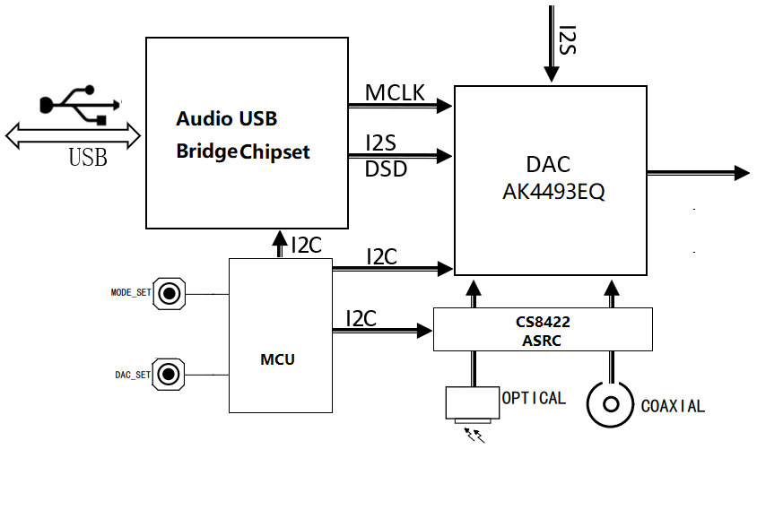
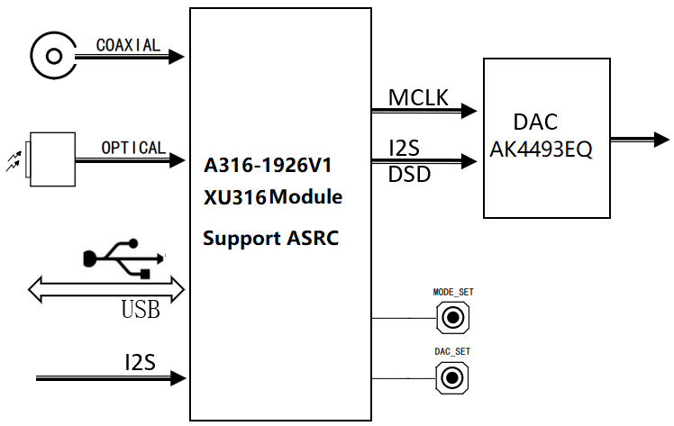

# “Hi-Fi需求一直有，外挂ASRC芯片可以无”——飞腾云已落地基于XMOS XU316 新一代USB桌面多路高清音频解码器Turnkey解决方案

--8<-- "common/phaten_xmos_support_img.md"

<!--markdown 看不到的内容-->

在音频世界的潮流里，Hi-Fi已然成为真正的音质追求者们的标配。高保真，即高度的真实再现音频信号，往往意味着我们需要复杂的技术配备——以往这包括了外挂ASRC（异步采样率转换）芯片。然而，在技术的不断革新中，我们已经能够颠覆传统，接近完美——飞腾云基于XMOS XU316的新一代USB桌面多路高清音频解码器Turnkey解决方案，带来了突破性的ASRC实现，让那些需要外挂ASRC芯片才能实现的产品，成为过去式。

<!-- more -->

## 技术革新：无需外挂ASRC芯片
在传统的USB音频解码器硬件方案中，为了实现采样率之间的无损转换，往往依赖于外挂的ASRC芯片，例如，市场常用的CS8422芯片，它支持最高192kHz采样率，达到了Hi-Fi的要求。但实际运用中，这意味着更复杂的硬件设计以及更高的成本，迫使开发者必须陷入繁多的电路图和编程中。与此相对照，飞腾云基于XMOS XU316 USB桌面多路高清音频解码器Turnkey解决方案彰显了“全能战士”的风范。此方案集成了USB声卡及多路Hi-Fi级别的ASRC功能，可支持高达192kHz的输入/输出采样率转换，超过135dB的信噪比和低至-120dB的THD+N，宽广的20Hz至90kHz频带响应，完全满足Hi-Fi音频所需的信噪比和总谐波失真的需求。

## 硬件 & 成本优化：从复杂到简明
传统的USB声卡解决方案多种芯片组合，造成硬件设计复杂度提升，而飞腾云的XU316模块简洁高效。它集成了多通道ASRC，减少了配件数量，从而大幅度的降低了成本，节约了宝贵的开发周期。对比之下，为达到XU316的性能标准，传统方案可能需要增加5-10美元的成本进行芯片配置。更为重要的是，XU316赋予了产品极高的兼容性，给多种接口留下了足够的空间，而不是像传统方案那样为每个接口搭配特定芯片。

- {align=right width=500}
传统的USB控制器+CS8422方案，多了CS8422和MCU，硬件设计复杂，还需要开发MCU。
    - **成本高**
    - **开发周期长**
    - **不同接口的产品需要更换不同的芯片方案**

- {align=left width=500}
基于飞腾云XMOS A316模组解决方案，以其一体化多声道ASRC设计，不仅提高了产品性能，还有效降低了制造成本

## 软件开发：从重投入到零负担
考虑到XMOS的特殊架构可能增加软硬件开发的难度，飞腾云提供一个针对USB桌面多路高清音频解码器Turnkey解决方案。我们为USB桌面多路高清音频解码器提供了一套完整的评估板、参考设计原理图、BOM表和元器件规格书，您可以根据这些参考设计快速开发出自己的USB桌面多路高清音频解码器产品。为了降低软件开发复杂性，所有XU316模组出厂时均预烧录客户所需固件，真正让客户可以享受到零软件开发就可以完成产品上市。

## 解决方案——速度决定胜负
在飞速发展的市场上，飞腾云Turnkey解决方案展现出了它无与伦比的优势。从一整套完善的硬件设计文件（原理图、BOM表、规格书）的提供到提供烧录客户固件的模组出货，都是为了使得客户能够快速完成Hi-Fi音频产品的开发。 
飞腾云基于XMOS XU316的USB桌面多路高清音频解码器Turnkey解决方案，已经可以做到，需求确认后，1天出方案，1周出样品，1个月量产，成为高效进军市场的新法门。

## 方案应用场景

- 桌面式USB高清多功能音响
- 桌面式USB高清音频解码器

## 方案产品

| 产品型号                            | 产品名称                          |产品图片                                 |
| :--------------------------------- | :--------------------------------- | :---------------------------------: |
|  [PBAX316-90108MV1评估板](/dev_doc/hifi_audio/pbax316_90108mv1/)  | XU316 Hi-Fi多路音频解码器评估板      |{width="150"} |
|  [AX316 -1926V1](/products/hifi_audio/a316_1926v1/)                     | XU316多路音频解码器模组              |{width="100"}   |

