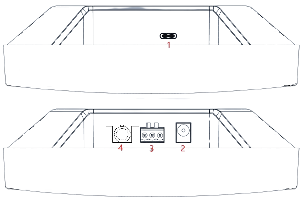
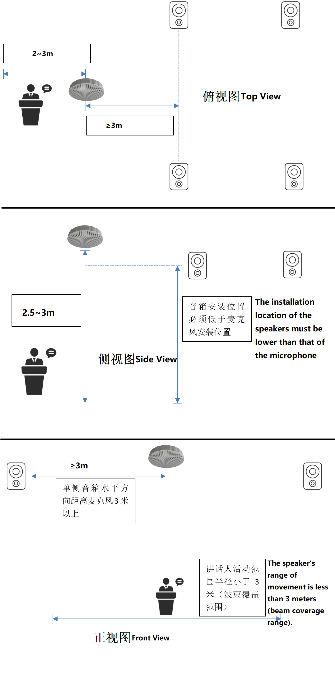

# FTXU316_LA_7MIC_V1 7MIC无感本地扩音PCBA成品及评估板安装使用说明

--8<-- "common/phaten_xmos_support_img.md"

## 接口说明
<figure markdown="span">
  {width="500"}
  <figcaption></figcaption>
</figure>

|序号|接口               | 功能描述
|:----:|:------------------|:------
|1     |USB-type C接口    |连接USB线，5V供电。
|2     |电源接口           |使用5V/1A电源适配器供电  
|3     |音频输出接口       |凤凰端子音频输出接口 
|4     |音频输出接口       |3.5mm音频输出接口

## 安装指导
### 安装位置
该产品为扩声麦克风，具有波束功能，安装位置需要满足以下条件：
1.	需要在实际场景的讲话人活动范围中心进行吊装。
2.	吊装高度需要高于场景中的音箱高度。
3.	吊装时保持产品麦克风收音面朝地，并保持产品与地面平行。
4.	将产品收音角度方向朝向讲话人侧的墙壁。

### 安装参考示意图
<figure markdown="span">
  {width="500"}
  <figcaption></figcaption>
</figure>

