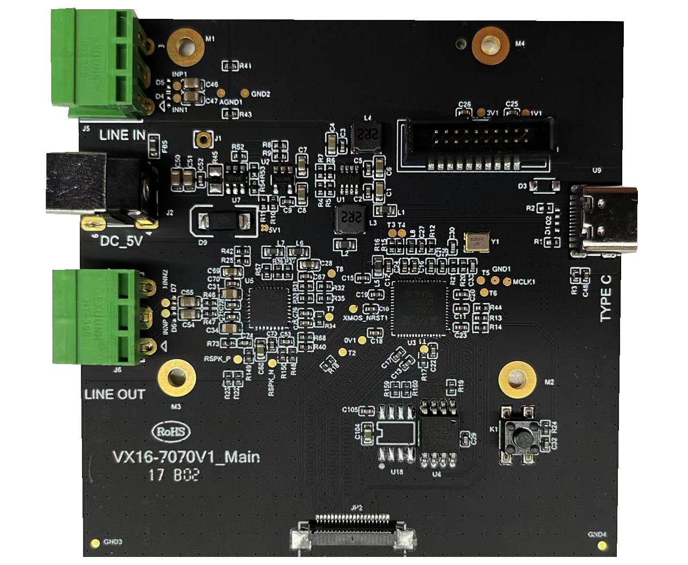

# FTXU316_LA_7MIC_V1 7MIC无感本地扩音PCBA套件产品规格书

--8<-- "common/phaten_xmos_support_img.md"

## 1、产品介绍
### 1.1 产品描述

在公共演讲、商务会议和教学环境中，高质量的声音传输至关重要。**FTXU316_LA_7MIC_V1** 正是为了满足这些场景的需求而设计，旨在为发言者提供无约束的扩音体验，同时确保听众能够享受到清晰、低延迟的听觉享受。

- {width="290"}  {width="250"}

### 1.2 产品特性

- **7麦阵列技术**：6+1 MIC麦阵，利用Beamforming技术精确控制拾音方向，旁瓣抑制高达40dB，显著降低外界噪声干扰。
- **极致音质处理**：通过32KHz/24bit的采样率处理人声，保证8kHz频响内高度保真输出。
- **低延迟体验**：从麦克风输入到Line-out输出的系统延迟仅为15ms，为发言者和听众提供无感扩声体验。
- **降噪与扩声**：内置NS降噪和AFC算法，提供10dB以上的扩声响度。

### 1.3 产品框图

<figure markdown="span">
  {width="500"}
  <figcaption></figcaption>
</figure>

### 1.4 麦克风阵列参数

| 参数项       | 最小值       | 最大值 | 单位   |
| :------------| :------: | :------: | :----: |
| 拾音半径      | 0           | 3      | m     |
| 频响         | 100          | 10K    | Hz    |
| 采样率       | -            | 32     | KHz   |
| 麦克风灵敏度  | -            | -29   | dB     |
| 动态范围     | -            | 99     | dB     |
| BF波束赋形   | 20           | 180    | °      |
| 反馈抑制     | 0            | 24     | dB     |
| 噪声抑制     | 0            | 25     | dB     |
| 旁瓣抑制     | 0            | 40     | dB     |

### 1.5 音频系统参数

|      参数项      |   最小值   | 典型值  |   最大值   |   单位   |
|:---------------|:---------:|:------:|:---------:|:-------:|
|     系统延迟     |    -     |    15   |     -    |    ms   |
|    扩声响度      |    -     |    10   |    -   |    dB   |
| 自动扩声增益调整 |    -20   |    -   |    +20    |    dB   |
|   额定输出阻抗    |    -    |    16   |     -     |    Ω    |

### 1.6 绝对电⽓参数

|            参数项             | 最小值  | 最大值 | 单位 |
|:---------------------------|:-------:|:------:|:----:|
|        存储温度          |   -40   |  125   |  ℃  |
|       供电电压         |  -0.5   | 3.63   |   V  |
| 静电释放电压（人体模型）@ TAMB -25℃ |   -2    |   2   |  KV  |
| 静电释放电压（充电设备模型）@ TAMB -25℃ |  -500  |  500  |   V  |

### 1.7 正常工作条件
|    功能    | 最小值 | 最大值 | 单位 |
|:---------|:------:|:------:|:----:|
| 工作温度  |   0    |   70   |  ℃   |
| 工作电压  |  3   |  3.6   |  V   |

### 1.8 工作电流
|⼯作状态   | 平均值 | 峰值 | 单位 |
|:---------|:------:|:------:|:----:|
| @5V      |   130  |   180  | mA   |

