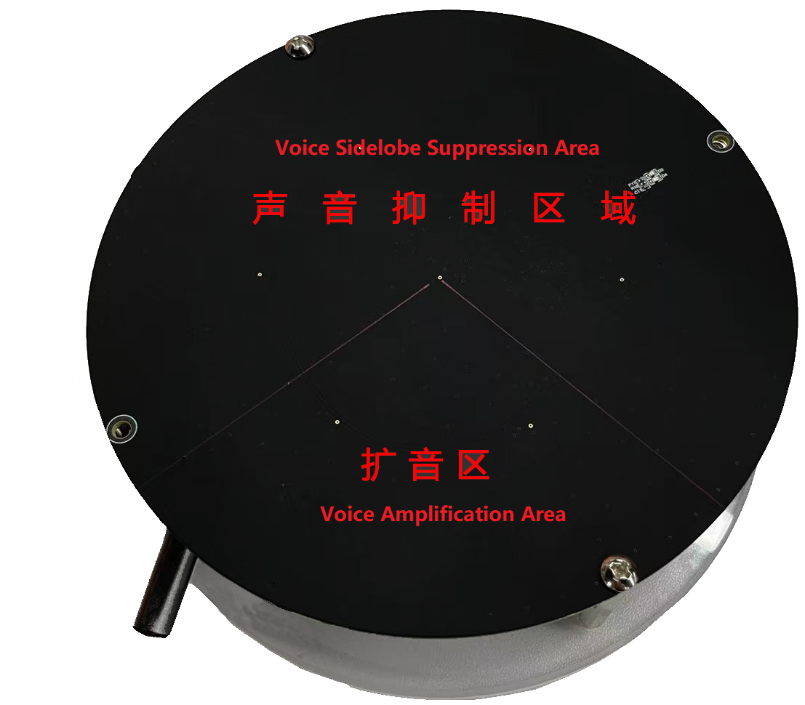
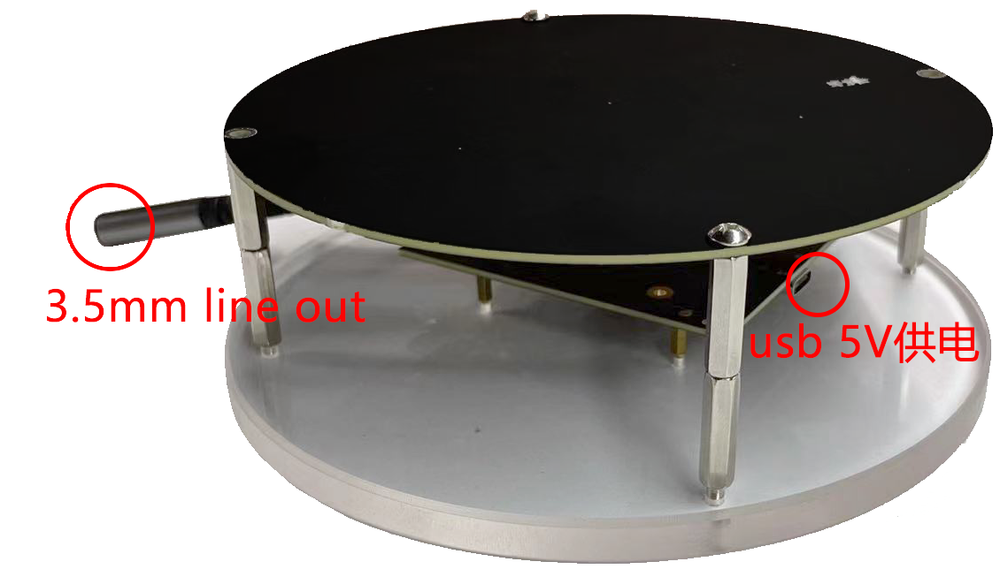

# FTXU316_LA_7MIC_V1 7MIC无感本地扩音评估板

--8<-- "common/phaten_xmos_support_img.md"

## 评估板介绍
**FTXU316_LA_7MIC_V1** 是为了满足在公共演讲、商务会议和教学环境中这些场景打造的专业级本地扩音产品，旨在为发言者提供无约束的扩音体验，同时确保听众能够享受到清晰、低延迟的听觉享受。**FTXU316_LA_7MIC_V1** 由XU316主板和7MIC阵列麦克风收音板两块PCBA组成。批量的产品制造，需要客户自行开发模具进行组装。为了便于客户快捷的评估 **FTXU316_LA_7MIC_V1 7MIC本地扩音** 的实际效果，我们特别为您精心设计了这款评估板。

  

- {width="260"}  {width="350"}

## 评估板详细参数和使用信息
有关评估板的详细参数以及安装调试指引，请参考[FTXU316_LA_7MIC_V1 PCBA套件详细信息](../ftxu316_la_7mic_v1/index.md)

## 评估板购买：
产品型号                            | 功能描述                           |状态                                  |购买                                 
:--------------------------------- | :--------------------------------- | :---------------------------------: | :---------------------------------: 
FTXU316_LA_7MIC_V1评估板   | 7MIC无感本地扩音评估板    | On Sale       |[FTXU316_LA_7MIC_V1评估板](https://detail.1688.com/offer/782121048089.html?_t=1714030593860&spm=a2615.7691456.co_1_0_wangpu_score_0_0_0_0_0_0_0000_0.0)

欢迎您体验我们的产品，感受科技与声音带来的无限魅力。

