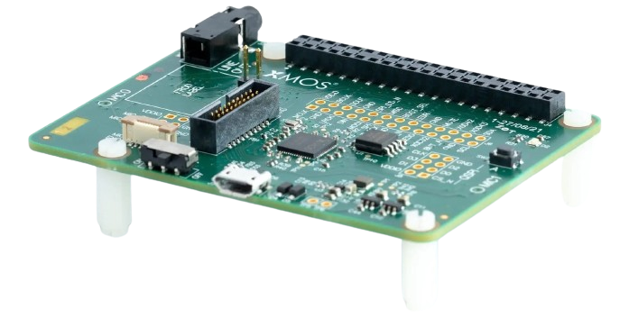

# XMOS XK-VOICE-L71 2MIC语音开发评估板

--8<-- "common/phaten_xmos_support_img.md"

{align=right width=300}

## 评估板介绍
XK-VOICE-L7这款语音参考设计评估套件可以用作Raspberry Pi HAT与示例的AVS客户端进行集成，或者独立作为USB外设连接到主机系统。

## 特性

- XU316-1024-QF60A-C24 xcore.ai 处理器
- Raspberry Pi HAT 连接器
- 2个Infineon IM69D130 MEMS 麦克风
- 71毫米的麦克风间距
- 麦克风静音开关
- 扬声器输出（线性电平）
- 支持 USB / I2S Host接口

## 评估板详细参数和资料
有关官方评估板的详细参数以及资料，请参考[XK-VOICE-L71详细信息](https://www.xmos.com/xk-voice-l71)

