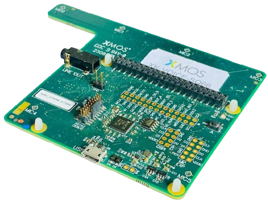

# XMOS XVF3800 EVALUATION KIT 4MIC语音会议评估板

--8<-- "common/phaten_xmos_support_img.md"

{align=right width=300}

## 评估板介绍
XK-VOICE-SQ66 4 麦克风语音会议评估套件用来评估 XVF3800 应用。

## 特性

- XU316-1024-QF60A-C24 xcore.ai 处理器
- Raspberry Pi HAT 连接器
- 2个Infineon IM69D130 MEMS 麦克风
- 71毫米的麦克风间距
- 麦克风静音开关
- 扬声器输出（线性电平）
- 支持 USB / I2S Host接口
- 一个 xcore.ai 处理器
- QSPI 闪存
- 一个用于音频输出的数字模拟转换器（DAC）
- 一个 USB 接口以及6个PDM麦克风。
    - 这些麦克风可以配置为100毫米的线性阵列或66毫米的方形四麦克风阵列，以适应不同的外壳。
- 可以安装一个扩展连接器，使用户能够将自己的自定义麦克风阵列连接到设备上。
- 通过 XMOS 标准的 XSYS2 连接器提供固件加载和调试访问，该连接器支持XTAG4调试适配器。
- 该板可以独立操作，配备了一个40针符合HAT规范的连接器和外形，使其可以安装在Raspberry Pi主机的顶部。

## 评估板详细参数和资料
有关官方评估板的详细参数以及资料，请参考[XVF3800 EVALUATION KIT详细信息](https://www.xmos.com/xk-voice-sq66)

