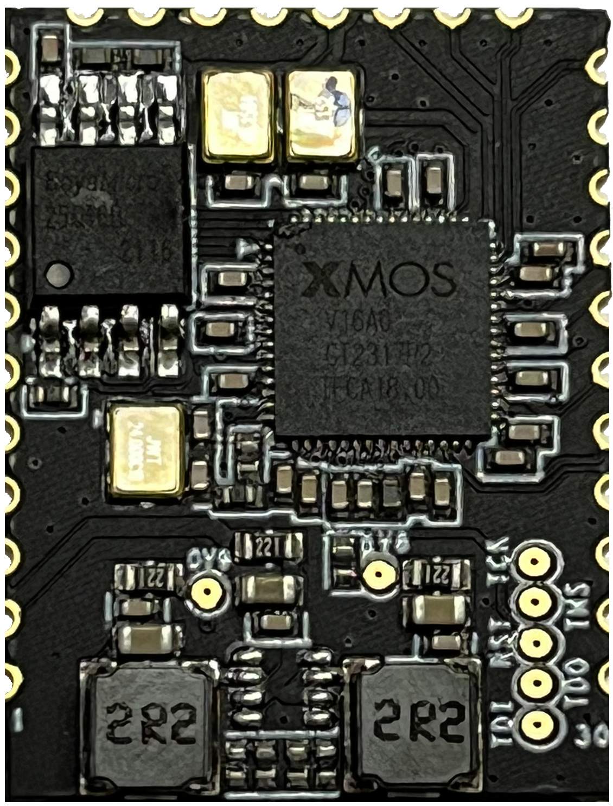

# A316-1926V1 USB多路音频解码器模组规格书
--8<-- "common/phaten_xmos_support_img.md"

{align=right width=250}
## 1、产品介绍
### 1.1 产品描述

- A316-1926V1是⼀款 USB多路高清音频解码器模组。模组使⽤XMOS的XU316-1024-QF60BC24芯⽚，集成了高精度DC-DC芯片，输出1.8V，0.9V电压给XU316 。模组集成了48.152MHz和49.152MHz有源晶体，满足不同高清音频采用率要求。模组内置XU316所需的24MHz晶体以及16Mbit Flash用来存储音频固件。
- A316-1926V1提供兼容全速和⾼速的USB2.0接⼝的USB AUdiO声卡设备，在USB 2.0异步模式中，能够⽀持⾼达768 KHz的采样率。
- 配合不同的固件，A316-1926V1可以处理高达6路SPDIF高清音频，以及2路I2S高清音频信号，满足多种高清音频解码器的需求。

### 1.2 产品特性

- **USB接口特性**
    - USB 2.0 (Full-speed and High-speed)
    - USB Audio Class 1.0
    - USB Audio Class 2.0
    - USB Firmware Upgrade (DFU)
    - USB Midi Device Class 1.0
- **支持音频协议**
    - I2S/TDM
    - S/PDIF(光钎/同轴)
    - Direct Stream Digital(DSD)
    - ADAT
- **支持音频采用率**
    - PCM: 44.1kHz, 48kHz, 88.2kHz, 96kHz, 176.4kHz, 192kHz, 352.8kHz, 384kHz，705.6kHz，768KHz
    - DSD: DSD 64 ,DSD 128, DSD 256, DSD 512 
    - DOP: DOP 64 ,DOP 128，DOP256
- **系统兼容**
    - UAC 2.0协议 ,支持ASIO ,支持多种操作系统，如Windows , Linux ,Android, MAC OS 和IOS等

### 1.3 产品框图

<figure markdown="span">
  {width="600"}
  <figcaption></figcaption>
</figure>

### 1.4 规格描述
  
| 规格项                   | 描述
| :------------------------| :----------
| 产品名称                  | A316-1926V1
| 产品描述                  | USB多路高清音频解码器模组
| 封装类型                  | SMT邮票孔
| 环保说明                  | 所有硬件部件完全符合欧盟RoHS指令

### 1.5 绝对电⽓参数
|    参数                        | 最小值 | 最大值 | 单位 |
|:------------------------------|:------:|:------:|:----:|
| 存储温度                       | -40   |  125  |  ℃   |
| 供电电压                       | -0.5   |  3.63 |  V   |
| 静电释放电压(⼈体模型)TAMB-25℃ | -2     |  2    | KV   |
| 静电释放电压(机器模型)TAMB-25℃ | -500   |  500  |  V   |

### 1.6 正常工作条件
|    功能    | 最小值 | 典型值 | 最大值 | 单位 |
|:---------|:------: |:------:|:------:|:----:|
| 工作温度  |   0    |   -   |   70   |  ℃   |
| 工作电压  |  3     |  3.3   |  3.6  |  V   |

### 1.7 工作电流
|⼯作状态   | 平均值 | 峰值 | 单位 |
|:---------|:------:|:------:|:----:|
| Active@3.3V      |   120  |  200  | mA   |

## 2、管脚定义

### 2.1 管脚布局
<figure markdown="span">
  {width=400}
  <figcaption></figcaption>
</figure>

### 2.2 管脚描述
| 模组管脚序号 | 名称  | 类型  | 功能  |
| :------: | :------: | :------: | :------ |
| 1 | GND | P | 模组地 |
| 2 | 3V3 | P | 模组3.3V供电 |
| 3 | X1D11 | I/O | 多功能GPIO，具体功能参考PortMap |
| 4 | X1D10 | I/O | 多功能GPIO，具体功能参考PortMap |
| 5 | X1D09 | I/O | 多功能GPIO，具体功能参考PortMap |
| 6 | X1D01 | I/O | 多功能GPIO，具体功能参考PortMap |
| 7 | X1D00 | I/O | 多功能GPIO，具体功能参考PortMap |
| 8 | X0D11 | I/O | 多功能GPIO，具体功能参考PortMap |
| 9 | X0D00 | I/O | 多功能GPIO，具体功能参考PortMap |
| 10 | X0D31 | I/O | 多功能GPIO，具体功能参考PortMap |
| 11 | X0D30 | I/O | 多功能GPIO，具体功能参考PortMap |
| 12 | X1D34 | I/O | 多功能GPIO，具体功能参考PortMap |
| 13 | X0D43 | I/O | 多功能GPIO，具体功能参考PortMap |
| 14 | X0D41 | I/O | 多功能GPIO，具体功能参考PortMap |
| 15 | X0D42 | I/O | 多功能GPIO，具体功能参考PortMap |
| 16 | MCLK | I/O | 49.152/45.1584MHz 时钟输出 |
| 17 | X0D40 | I/O | 多功能GPIO，具体功能参考PortMap |
| 18 | X0D38 | I/O | 多功能GPIO，具体功能参考PortMap |
| 19 | X0D37 | I/O | 多功能GPIO，具体功能参考PortMap |
| 20 | X0D36 | I/O | 多功能GPIO，具体功能参考PortMap |
| 21 | X0D35 | I/O | 多功能GPIO，具体功能参考PortMap |
| 22 | X0D29 | I/O | 多功能GPIO，具体功能参考PortMap |
| 23 | X1D22 | I/O | 多功能GPIO，具体功能参考PortMap |
| 24 | X1D19 | I/O | 多功能GPIO，具体功能参考PortMap |
| 25 | X1D16 | I/O | 多功能GPIO，具体功能参考PortMap |
| 26 | USB_DP | I/O | USB_DP |
| 27 | USB_DM | I/O | USB_DM |
| 28 | X1D18 | I/O | 多功能GPIO，具体功能参考PortMap |
| 29 | X1D17 | I/O | 多功能GPIO，具体功能参考PortMap |
| 30 | X1D13 | I/O | 多功能GPIO，具体功能参考PortMap |

## 3、模组尺⼨和PCB封装图形
### 3.1 模组尺⼨
PCB尺⼨：19.5±0.3(L)X26±0.3(W)X0.8±0.1(H)

### 3.2 模组封装图
<figure markdown="span">
  {width=400}
  <figcaption></figcaption>
</figure>

## 4、产品包装信息
托盘+外箱包装

## 5、推荐回流焊炉温曲线
<figure markdown="span">
  {width=600}
  <figcaption></figcaption>
</figure>
