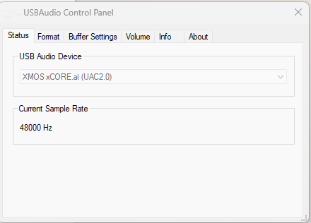

# PBAX316-90108MV1 USB桌面高清音频解码器评估板使用说明

- {width="200"}  {width="200"}  **联合支持**   [XMOS官网: www.xmos.com](https://www.xmos.com)    [飞腾云音频解决方案官网: www.phaten-iot.com](https://www.phaten-iot.com)

## 第一次使用
用户拿到评估板后，可以安装以下步骤安装配置环境，进行评估。

### 安装驱动
评估板支持 USB UAC 2.0 播放音频， Windows 10 build 1809 及以后的版本， 已经有原生的USB UAC 2.0的驱动。但原生的驱动只能播放最高384Khz采样率音频。 如要评估768Khz采样率和DSD格式则需要安装第三方驱动。

{align=right width=300}
#### Windows系统:

1. 下载评估版驱动[Thesycon-USB-Audio-Class-2_0-Evaluation-Driver-for-Windows_5_58_0.zip](../../assets/download/Thesycon-USB-Audio-Class-2_0-Evaluation-Driver-for-Windows_5_58_0.zip)。解压后，直接运行XMOS_TUSBAudio_eval_v5.58.0_2023-06-29_setup.exe， 一路默认安装就可以了。

2. 通过USB线连接评估板和windows电脑，在右下角有点击TUSB图标，如果USB Audio Device显示如右图，就表示驱动运行正常。

3. 评估板在设备管理器上枚举成了 USB 2.0 Audio Devices（UAC2.0）

4. 在播放栏项，设置USB 2.0 Audio Devices（UAC2.0）为默认设备

#### Linux系统:
  不需要安装驱动
#### Mac 系统:
  不需要安装驱动
#### 手机:
  不需要安装驱动

## 音频评估
评估板上有3个指示灯，USB， OPT， COX分别表示USB，光纤，同轴模式。

- 短按MODE按键，USB指示灯亮，播放USB音频。
- 短按MODE按键，OPT指示灯亮，播放OPT音频。
- 短按MODE按键，COX指示灯亮，播放COX音频。