# PBAX316-90108MV1 USB桌面高清音频解码器评估板测试指标

- {width="200"}  {width="200"}  **联合支持**   [XMOS官网: www.xmos.com](https://www.xmos.com)    [飞腾云音频解决方案官网: cheng5230.github.io](https://cheng5230.github.io/)

## 1, USB INPUT 1KHz RCAOUT测试指标
### THD+N Ratio
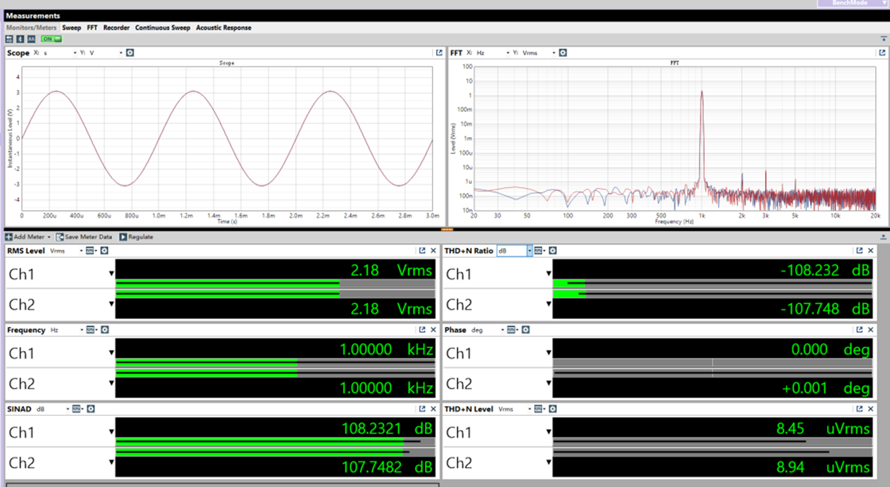

### Frequency Response
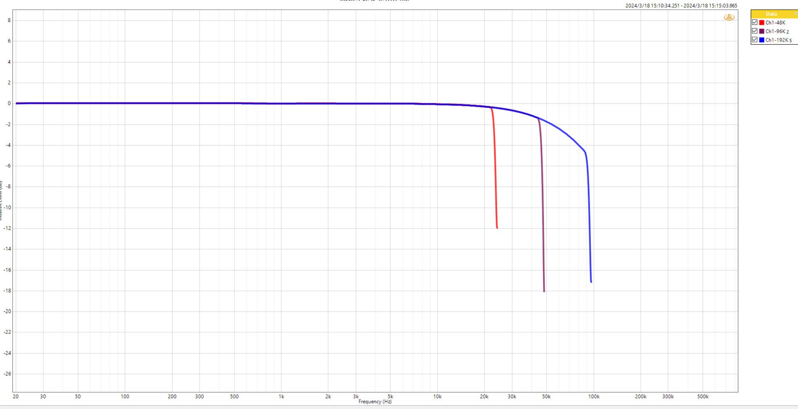

### THD+N Level
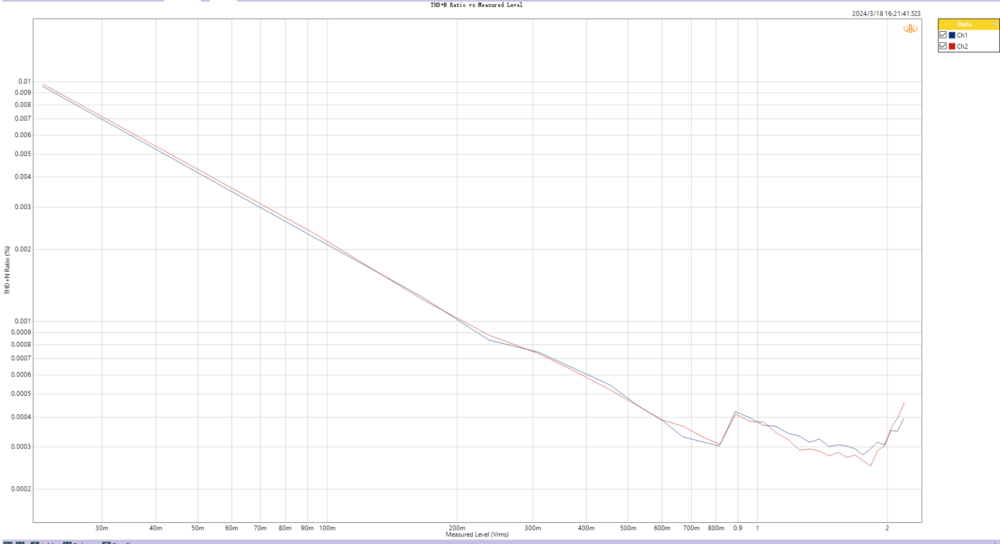

### SNR
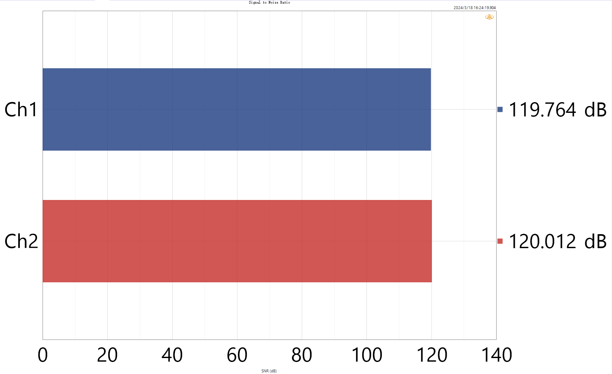

### Signal-to-Noise and Distortion Ratio
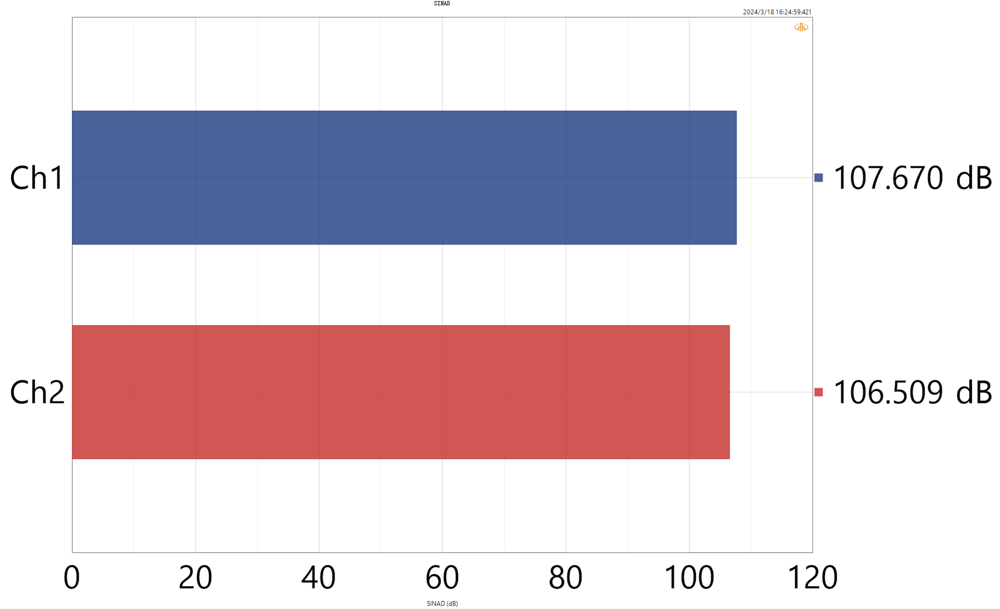

### CROSSTALK
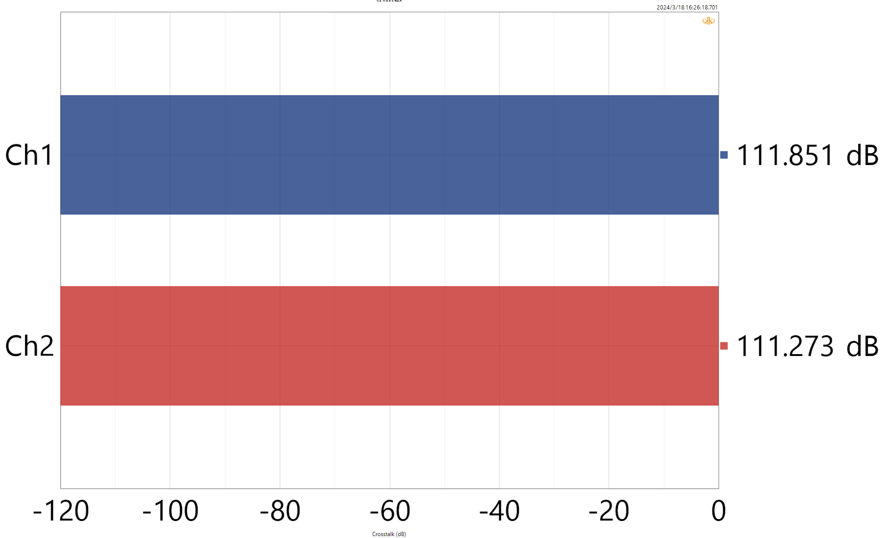

### Noise Level
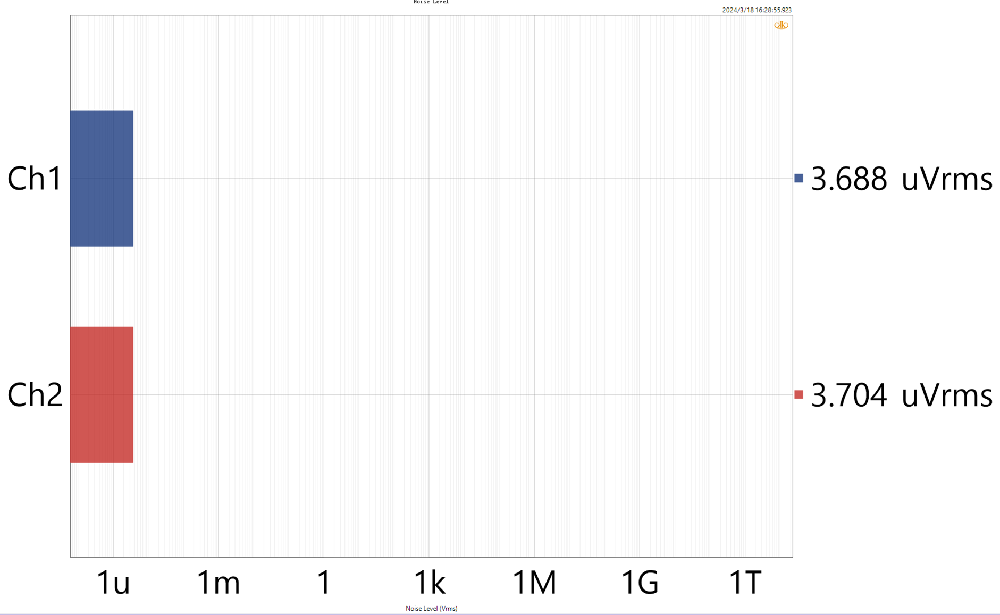

## 2, S/PDIF INPUT 1KHz RCAOUT测试指标
### THD+N Ratio
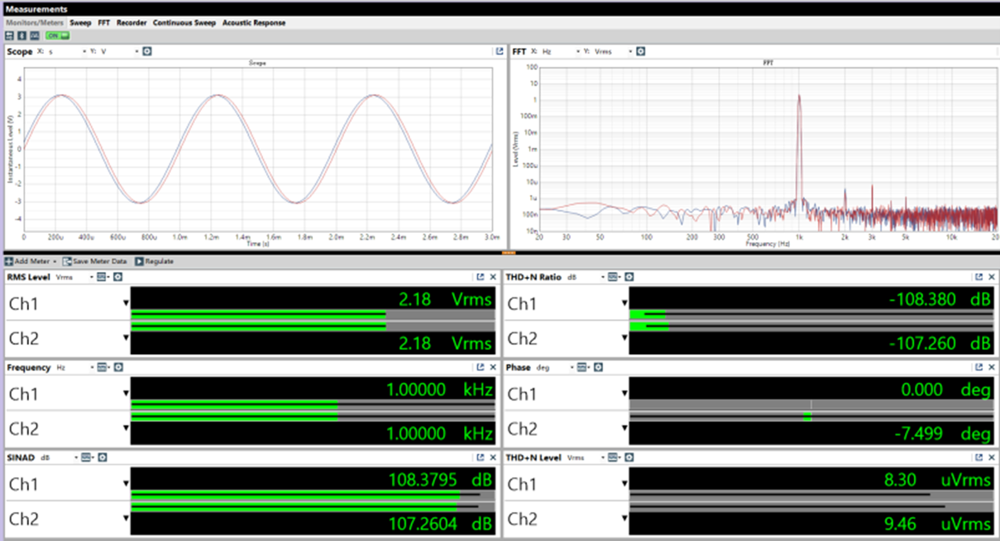

### Frequency Response
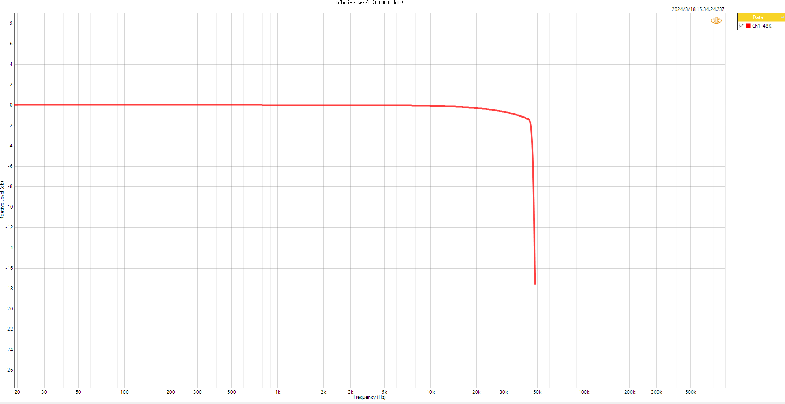

### THD+N Level
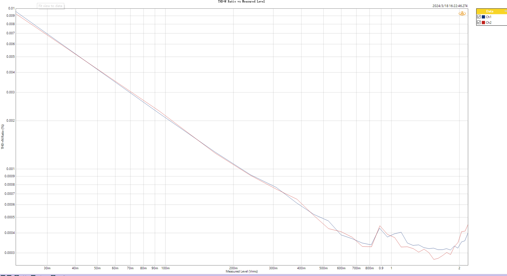

### SNR
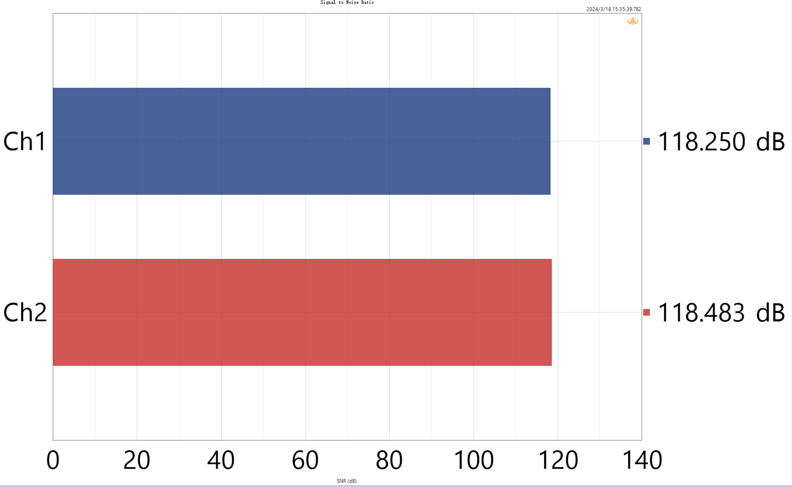

### Signal-to-Noise and Distortion Ratio
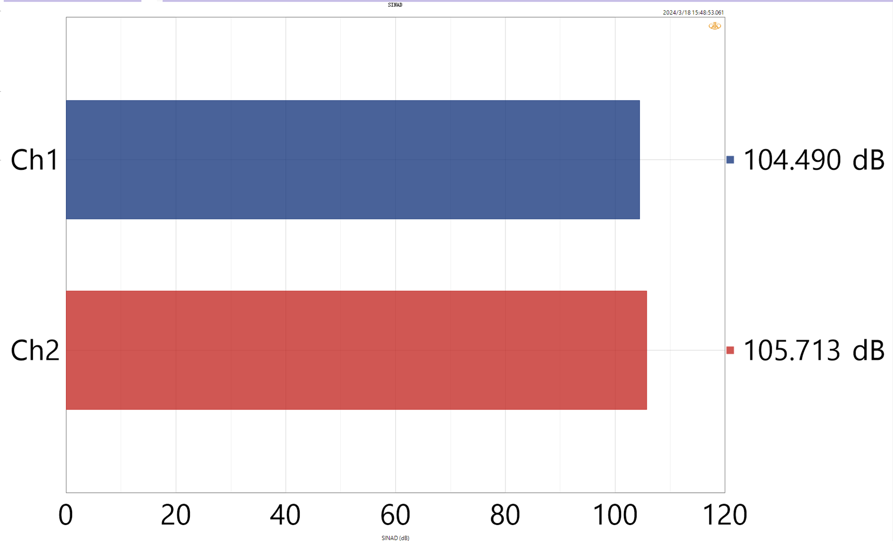

### CROSSTALK

### Noise Level
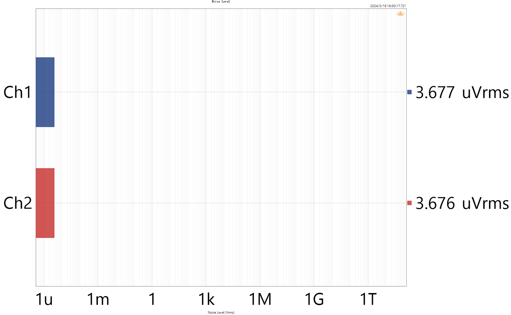