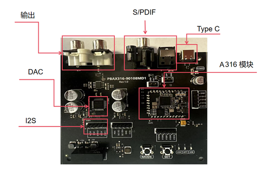

# PBAX316-90108MV1 USB桌面高清音频解码器评估板规格书

- {width="200"}  {width="200"}  **联合支持**   [XMOS官网: www.xmos.com](https://www.xmos.com)    [飞腾云音频解决方案官网: www.phaten-audio.com](https://www.phaten-audio.com)

{align=right width=250}
## 1、产品介绍
### 1.1 产品描述

PBAX316-90108MV1是专为USB桌面高清音频解码器设计的评估板，其采用飞腾云A316_1926V1 XU316模组设计。评估板支持USB，光钎，同轴以及I2S音频信号源输入。通过按键选择不同的音频输入源。评估板采用AKM4493SEQ DAC输出模拟音频。

### 1.2 评估板特性

- **支持音频接口**
    - USB 2.0 (Full-speed and High-speed)
    - I2S/TDM
    - S/PDIF(光钎/同轴)
    - Direct Stream Digital(DSD)
- **支持音频接口**
    - PCM: 44.1kHz, 48kHz, 88.2kHz, 96kHz, 176.4kHz, 192kHz, 352.8kHz, 384kHz，705.6kHz，768KHz
    - DSD: DSD 64 ,DSD 128, DSD 256, DSD 512 
    - DOP: DOP 64 ,DOP 128，DOP256
- **系统兼容**
    - UAC 2.0协议 ,支持ASIO ,支持多种操作系统，如Windows , Linux ,Android, MAC OS 和IOS等

### 1.3 评估板硬件接口

<figure markdown="span">
  {width="600"}
  <figcaption></figcaption>
</figure>

| 接口                | 功能       
| :-------------------| :----------
| Type-C              | 接PC/手机USB，USB音频输入以及5V供电
| S/PDIF              | 接光钎/同轴数字音频输入
| I2S                 | I2S 输入输入
| 输出                | RCA左右声道模拟音频输出

### 1.4 评估板关键音频指标

**USB音频输入，和DAC AKM4493匹配**

| 参数项                    | 数值       
| :------------------------| :----------: 
| THD+N RATIO              | 108.232dB
| SIGNAL-NOISE RATIO       | 120.012dB
| RCAOUT Crosstalk(10K)    | 111.851dB

**S/PDIF音频输入，和DAC AKM4493匹配**

| 参数项                    | 数值       
| :------------------------| :----------: 
| THD+N RATIO              | 108.380dB
| SIGNAL-NOISE RATIO       | 118.483dB
| RCAOUT Crosstalk(10K)    | 115.302dB

### 1.5 正常工作条件
|    功能    | 最小值 | 最大值 | 单位 |
|:---------|:------:|:------:|:----:|
| 工作温度  |   0    |   70   |  ℃   |
| 工作电压  |  4.5   |  5     |  V   |

### 1.8 工作电流
|⼯作状态   | 平均值 | 峰值 | 单位 |
|:---------|:------:|:------:|:----:|
| @5V      |   250  |   300  | mA   |
