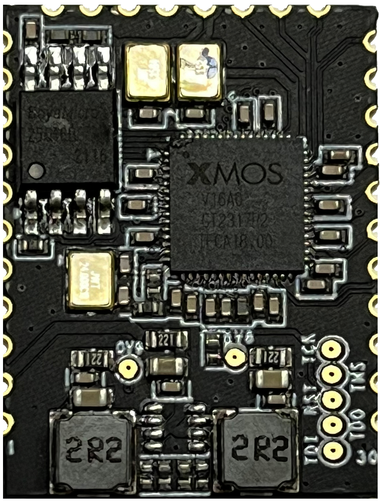
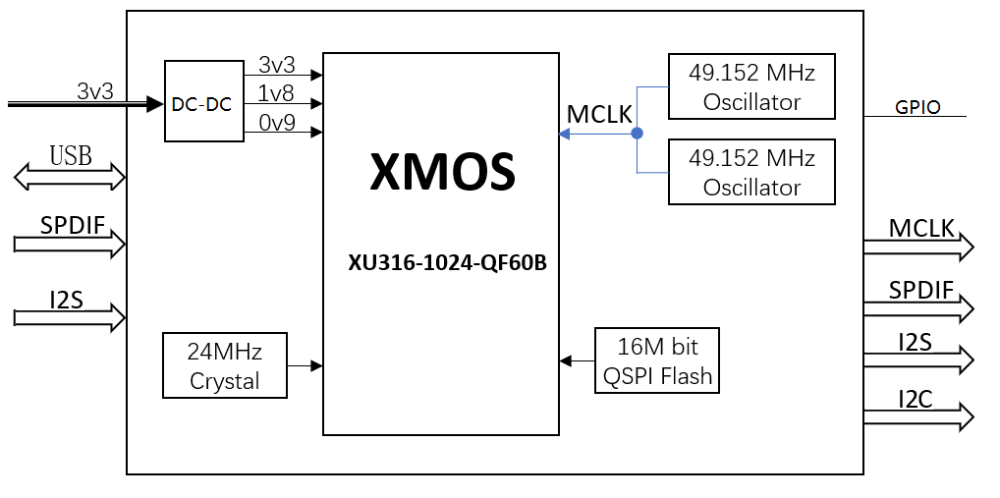

# A316-1926V1 USB多路音频解码器模组规格书

--8<-- "common/phaten_xmos_support_img.md"

{align=right width=250}
## 1、产品介绍
### 1.1 产品描述

- A316-1926V1是⼀款 USB多路高清音频解码器模组。模组使⽤XMOS的XU316-1024-QF60BC24芯⽚，集成了高精度DC-DC芯片，输出1.8V，0.9V电压给XU316 。模组集成了48.152MHz和49.152MHz有源晶体，满足不同高清音频采用率要求。模组内置XU316所需的24MHz晶体以及16Mbit Flash用来存储音频固件。
- A316-1926V1提供兼容全速和⾼速的USB2.0接⼝的USB AUdiO声卡设备，在USB 2.0异步模式中，能够⽀持⾼达768 KHz的采样率。
- 配合不同的固件，A316-1926V1可以处理高达6路SPDIF高清音频，以及2路I2S高清音频信号，满足多种高清音频解码器的需求。

### 1.2 产品特性

- **USB接口特性**
    - USB 2.0 (Full-speed and High-speed)
    - USB Audio Class 1.0
    - USB Audio Class 2.0
    - USB Firmware Upgrade (DFU)
    - USB Midi Device Class 1.0
- **支持音频协议**
    - I2S/TDM
    - S/PDIF(光钎/同轴)
    - Direct Stream Digital(DSD)
    - ADAT
- **支持音频采用率**
    - PCM: 44.1kHz, 48kHz, 88.2kHz, 96kHz, 176.4kHz, 192kHz, 352.8kHz, 384kHz，705.6kHz，768KHz
    - DSD: DSD 64 ,DSD 128, DSD 256, DSD 512 
    - DOP: DOP 64 ,DOP 128，DOP256
- **系统兼容**
    - UAC 2.0协议 ,支持ASIO ,支持多种操作系统，如Windows , Linux ,Android, MAC OS 和IOS等

### 1.3 产品框图

<figure markdown="span">
  {width="600"}
  <figcaption></figcaption>
</figure>

## 2、[产品技术文档](../../../dev_doc/hifi_audio/a316_1926v1/index.md)
  

## 3、产品购买：
产品型号                   | 功能描述                  |状态               |购买                                 
:------------------------ | :------------------------| :---------------: | :----------------: 
A316-1926V1               | USB多路高清音频解码器模组  | On Sale      |[A316-1926V1](https://detail.1688.com/offer/781956090278.html?_t=1714031321311&spm=a2615.7691456.co_1_0_wangpu_score_0_0_0_0_0_0_0000_0.0)
