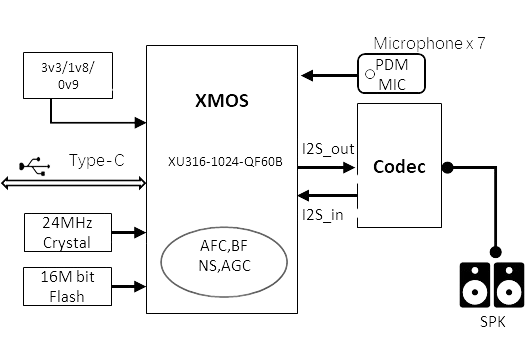

# 飞腾云XU316 7MIC无感本地扩音方案

--8<-- "common/phaten_xmos_support_img.md"

## 方案背景

在公共演讲、商务会议和教学环境中，高质量的声音传输至关重要。我们的 **XU316 7MIC无感本地扩音方案** 正是为了满足这些场景的需求而设计，旨在为发言者提供无约束的扩音体验，同时确保听众能够享受到清晰、低延迟的听觉享受。

## 方案技术特色

- **7麦阵列技术**：利用Beamforming技术精确控制拾音方向，显著降低外界噪声干扰，实现高达40dB的音隔离效果。
- **极致音质处理**：通过32KHz/24bit的采样率处理人声，保证8kHz频响内高度保真输出。
- **低延迟体验**：15ms的系统延迟，结合10dB以上的扩声响度，为发言者和听众提供无感延迟体验。

## 方案关键参数

| 参数项               | 数值                 |
| :------------------- | :------------------- |
| 拾音半径              | ≥3米                 |
| 频响                 | 100Hz~10KHz           |
| 采样率               | 32KHz                 |
| 麦克风灵敏度         | -29dB                 |
| 动态范围             | 99dB                 |
| BF波束赋形           | 20~180度,可配置      |
| 电源功耗             | 5V@130mA            |
| 反馈抑制             | 0-24dB              |
| 噪声抑制             | 0-25dB              |
| 旁瓣抑制             | 0-40dB              |
| 系统延迟             | 15ms                |
| 扩声响度             | >=10dB              |
| 自动扩声增益调整      | -20dB-+20dB         |

## 方案框图

<figure markdown="span">
  {width="500"}
  <figcaption></figcaption>
</figure>

## 核心技术解读

### XMOS主控

核心搭载XMOS XU316处理器，具备3200MIPS算力和1MB SRAM的DSP资源，实现零延时音频接口，提供极低延迟体验，同时内置VPU加速处理，便于集成算法模块。

### DSP算法处理

- **波束形成**：6+1 MIC麦阵波束形成，旁瓣抑制高达40dB。
- **低延迟**：从麦克风输入到Line-out输出的系统延迟仅为15ms。
- **高保真音质**：以32KHz@24bit格式处理，输出人声频响高达8KHz。
- **降噪与扩声**：内置NS降噪和AFC算法，提供10dB以上的扩声响度。

我们的XU316 7MIC无感本地扩音方案，是市场上性能最强大的本地扩音产品之一，为您的演讲和会议场合创造完美的听觉体验。

## 方案产品

| 产品型号                            | 产品名称                           |产品图片                                 |
| :--------------------------------- | :--------------------------------- | :---------------------------------: |
| [FTXU316-LA-7MIC-V1](../../../products/array_mic/ftxu316_la_7mic_v1_pcba)                 | XU316 7MIC无感本地扩音PCBA     |    {width="250"} |
